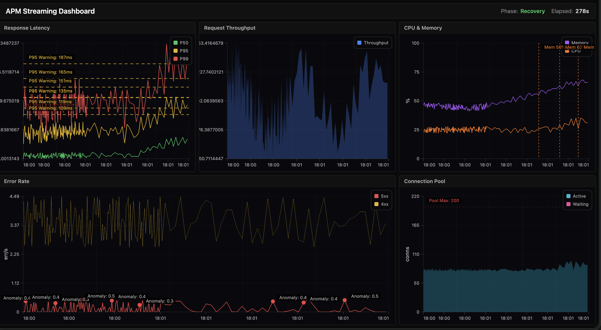

<p align="center">
  
</p>

<p align="center">
  WebGPU charting library for large datasets, real-time streaming, multi-chart dashboards, and 3D series.
  MIT licensed. Zero npm runtime dependencies.
</p>

<p align="center">
  <a href="https://www.npmjs.com/package/@chartgpu/chartgpu"></a>
  <a href="https://github.com/chartgpu/chartgpu/actions/workflows/tests.yml"></a>
  <a href="https://github.com/chartgpu/chartgpu/blob/main/LICENSE"></a>
  <a href="https://chartgpu.io/docs/getting-started/"></a>
  <a href="https://chartgpu.io"></a>
  <a href="https://github.com/mikbry/awesome-webgpu"></a>
</p>

<p align="center">
  <a href="https://chartgpu.io">Live demo</a> ·
  <a href="https://chartgpu.io/docs/">Docs</a> ·
  <a href="https://chartgpu.io/docs/api/">API</a> ·
  <a href="examples/">Examples</a>
</p>

---

## Overview

ChartGPU renders charts with **WebGPU** (not Canvas2D or WebGL). It is aimed at:

- Dense time series and multi-million-point series
- Streaming updates (`appendData` with optional ring capacity)
- Shared-device multi-chart dashboards
- 2D series plus `cartesian3d` (`pointCloud3d`, `surface3d`)

There is **no WebGL/Canvas fallback**. Unsupported browsers must be gated by the host app.

---

## Demo


Streaming multi-chart wall (shared GPU device):



[Streaming dashboards](https://chartgpu.io/docs/streaming-dashboards/) · [Multi-chart cookbook](docs/guides/multichart-dashboard-cookbook.md) · [Live examples](https://chartgpu.io/#examples)

| Scatter density | Candlestick / OHLC | Annotations |
|:---:|:---:|:---:|
|  |  |  |

---

## Install

```bash
npm install @chartgpu/chartgpu
```

Also published as unscoped `chartgpu` (same version line). React bindings: [`chartgpu-react`](https://github.com/ChartGPU/chartgpu-react) (`npm i chartgpu-react @chartgpu/chartgpu`).

### Minimal example

```ts
import { ChartGPU } from '@chartgpu/chartgpu';

const el = document.getElementById('chart')!;
const chart = await ChartGPU.create(el, {
  series: [{
    type: 'line',
    data: {
      x: new Float64Array([0, 1, 2]),
      y: new Float64Array([1, 3, 2]),
    },
  }],
});

// Prefer column-shaped x/y at scale; object/[x,y] tuples are fine for small demos
const x = new Float64Array([3, 4, 5]);
const y = new Float64Array([2.5, 2.1, 2.8]);
chart.appendData(0, { x, y }, { maxPoints: 50_000 });
```

Requires a WebGPU-capable browser (see [Browser support](#browser-support)).

---

## Features

- **Streaming** — `appendData` with optional `maxPoints` ring (FIFO). Heatmap and 3D surfaces use dedicated update APIs (`updateHeatmap`, `updateSurface3D`) rather than full option rewrites every tick.
- **Sampling** — LTTB / min / max on the CPU; eligible line series can run decimation on the GPU. Nulls create gaps; optional `connectNulls`. `performance.lod`: `auto` | `strict`.
- **Multi-chart** — Share one `GPUDevice` and pipeline cache across charts (≥3 recommended). Zoom sync via `connectCharts`.
- **Interaction** — Zoom, pan, multi-axis Y scales, dark/light/custom themes, annotations.
- **3D** — `coordinateSystem: 'cartesian3d'` with `pointCloud3d` and `surface3d`.
- **Dependencies** — Zero npm runtime dependencies. MIT license for commercial embedding.

Architecture notes: [docs/ARCHITECTURE.md](docs/ARCHITECTURE.md). Performance guide: [chartgpu.io/docs/performance](https://chartgpu.io/docs/performance/). Theming: [chartgpu.io/docs/theming](https://chartgpu.io/docs/theming/).

---

## Series types

Full options: [API — options](https://chartgpu.io/docs/api/options/).

| Category | Types / modes | Docs |
|----------|----------------|------|
| Cartesian | `line`, `area`, `bar`, `scatter`, `pie` | [line](https://chartgpu.io/docs/series/line/) · [scatter](https://chartgpu.io/docs/series/scatter/) |
| Finance | `candlestick`, `ohlc` | [candlestick](https://chartgpu.io/docs/series/candlestick/) |
| Scientific | `heatmap`, `band`, `errorBar`, `impulse` | [heatmap](https://chartgpu.io/docs/series/heatmap/) |
| Variants | step line/area · stacked mountain · scatter `mode: 'density'` | [charting](https://chartgpu.io/docs/charting/) |
| 3D | `pointCloud3d`, `surface3d` | [3D API](https://chartgpu.io/docs/api/3d/) |

---

## Multi-chart (shared device)

For three or more charts on one page, create a single adapter/device/pipeline cache and pass it into each `ChartGPU.create`. Charts do not destroy a shared device on dispose.

```ts
import { ChartGPU, createPipelineCache, connectCharts } from '@chartgpu/chartgpu';

if (!navigator.gpu) {
  throw new Error('WebGPU not available');
}

const adapter = await navigator.gpu.requestAdapter({ powerPreference: 'high-performance' });
if (!adapter) throw new Error('No GPU adapter');

const device = await adapter.requestDevice();
const pipelineCache = createPipelineCache(device);
const ctx = { adapter, device, pipelineCache };

const a = await ChartGPU.create(document.getElementById('a')!, {
  series: [{ type: 'line', data: { x: new Float64Array([0]), y: new Float64Array([0]) } }],
}, ctx);
const b = await ChartGPU.create(document.getElementById('b')!, {
  series: [{ type: 'line', data: { x: new Float64Array([0]), y: new Float64Array([0]) } }],
}, ctx);
const c = await ChartGPU.create(document.getElementById('c')!, {
  series: [{ type: 'line', data: { x: new Float64Array([0]), y: new Float64Array([0]) } }],
}, ctx);

connectCharts([a, b, c], { syncZoom: true });
// Optional: setRenderMode('external') + renderFrame() for a single app rAF loop
```

Recipes: [multi-chart cookbook](docs/guides/multichart-dashboard-cookbook.md) · [streaming dashboards](https://chartgpu.io/docs/streaming-dashboards/).

---

## Browser support

WebGPU only. No WebGL path.

| Browser | Support |
|---------|---------|
| Chrome / Edge | 113+ |
| Safari | 18+ |
| Firefox | Windows 114+; macOS 145+; Linux incomplete — see [gpuweb status](https://github.com/gpuweb/gpuweb/wiki/Implementation-Status) |

Detect `navigator.gpu` before creating charts. Do not leave an unsupported user on a blank canvas without UI.

If you need Canvas/SVG or dual WebGL+WebGPU backends, use a library that ships those fallbacks.

---

## Documentation

| Resource | Description |
|----------|-------------|
| [Docs hub](https://chartgpu.io/docs/) | Guides and series docs |
| [Getting started](https://chartgpu.io/docs/getting-started/) | Install and first chart |
| [API reference](https://chartgpu.io/docs/api/) | `create`, options, streaming, interaction, 3D |
| [Charting](https://chartgpu.io/docs/charting/) | Series, axes, interaction |
| [Streaming dashboards](https://chartgpu.io/docs/streaming-dashboards/) | Shared device, multi-chart |
| [Annotations](https://chartgpu.io/docs/annotations/) | Lines, markers, labels |
| [Performance](https://chartgpu.io/docs/performance/) | Density, sampling, GPU sharing |
| [Theming](https://chartgpu.io/docs/theming/) | Dark / light / custom |
| [Architecture](docs/ARCHITECTURE.md) | Render path (repo) |
| [Internals](docs/api/INTERNALS.md) | Contributors |
| [`examples/`](examples/) | Local Vite samples |

```bash
npm install
npm run dev
# open the examples URL printed by the dev server
```

---

## Contributing

See [CONTRIBUTING.md](CONTRIBUTING.md) and [docs/ARCHITECTURE.md](docs/ARCHITECTURE.md).

## License

[MIT](LICENSE). Free for commercial use. No npm runtime dependencies.
