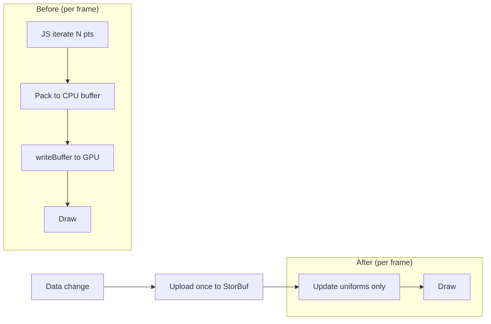

# ChartGPU Performance Remediation Plan

## Goal
Close the performance gap with SciChart.js and LCJS v8 at scale (100K-10M points) by eliminating the 6 root causes identified in the benchmark analysis. Target: maintain 60+ FPS at 1M points across all series types.

---

## Phase 1: Auto-Sampling + Eliminate CPU-Side Data Repacking (Root Causes 1, 2 & 4)
**Impact: CRITICAL -- auto-sampling alone is the single highest-leverage change**
**Estimated complexity: High (renderer migration), Medium (auto-sampling)**

Auto-sampling runs in parallel with the renderer migrations. Even before renderers move to storage buffers, auto-sampling caps the work to ~2-4K points per series, making the existing CPU paths tolerable at any dataset size.

The scatter, candlestick, and area renderers rebuild entire vertex/instance buffers from JS every `prepare()` call. The line renderer already uses the correct pattern (storage buffer + affine transform in shader). Phase 1 migrates the other renderers to match.

### 1a. Viewport-Pixel-Aware Auto-Sampling (parallel with 1b-1e)
- **Current**: Sampling defaults to `'none'`. User must explicitly configure `sampling` and `samplingThreshold`. No adaptive logic
- **Target**: Add a new sampling mode `'auto'` (new default for line/area/scatter). When enabled:
  - Compute `maxVisiblePoints = plotWidthPx * samplingDensity` (default density: 2-4 points per pixel)
  - If `pointCount > maxVisiblePoints`, automatically apply LTTB downsampling to `maxVisiblePoints`
  - Recalculate on zoom/resize (viewport width changes)
  - `sampling: 'none'` remains available for users who want raw data
- **Files**: `sampleSeries.ts`, `OptionResolver.ts`, `createRenderCoordinator.ts`

### 1b. Scatter Renderer -- Storage Buffer + Shader Transform
- **Current**: `prepare()` iterates all N points in JS, writes `[x, y, radiusPx, pad]` per point into a CPU staging buffer, then `writeBuffer()` to GPU every frame (~400K float writes at 100K points)
- **Target**: Upload raw `[x, y]` data to a storage buffer once via `DataStore.setSeries()` (already exists for line). Vertex shader reads from storage buffer and applies the affine transform uniform (already computed as `ax, bx, ay, by`). Move radius computation to the shader using a uniform for `symbolSize` (constant case) or a separate per-point size buffer (function case)
- **Files**: `createScatterRenderer.ts`, `scatter.wgsl`, `renderSeries.ts`

### 1c. Candlestick Renderer -- Storage Buffer + Shader Transform
- **Current**: `prepare()` iterates all candles, calls `xScale.scale()` and `yScale.scale()` per point in JS to convert to clip space, then packs 40 bytes/instance and uploads via `writeBuffer()` every frame
- **Target**: Upload raw OHLC data `[timestamp, open, close, low, high]` to storage buffer once. Pass scale transform as uniforms. Shader computes clip-space positions. Color selection (up/down) moves to shader via `step(open, close)`
- **Files**: `createCandlestickRenderer.ts`, `candlestick.wgsl`, `renderSeries.ts`

### 1d. Area Renderer -- Storage Buffer + Shader Transform
- **Current**: `createAreaVertices()` allocates a new `Float32Array` and iterates all points every frame, writing `[x, y, x, y]` pairs for triangle-strip topology
- **Target**: Reuse the line renderer's `DataStore` buffer (area data is the same `[x, y]` series). Shader generates triangle-strip topology from storage buffer reads using `vertex_index` parity (even vertex = data point, odd vertex = baseline). Transform via uniform affine matrix
- **Files**: `createAreaRenderer.ts`, `area.wgsl`, `renderSeries.ts`

### 1e. Use `mappedAtCreation` for Initial Uploads
- **Current**: Zero uses of `mappedAtCreation` in the codebase. All initial data goes through `writeBuffer()` (4 memory layer copies per spec)
- **Target**: In `createDataStore.ts`, when creating a new buffer, use `mappedAtCreation: true` and write directly into the mapped range. Eliminates the separate `writeBuffer()` call for initial loads
- **Files**: `createDataStore.ts`

### 1f. Async Pipeline Creation
- **Current**: All renderers use synchronous `device.createRenderPipeline()` which may stall the device timeline at first use
- **Target**: Switch to `device.createRenderPipelineAsync()` for all renderer pipelines. Pipelines are created during chart initialization, not mid-frame, so the async pattern fits naturally. Supply `compilationHints` in `createShaderModule()` with known entry points and layouts to enable early pre-compilation
- **Effort**: Low -- mechanical change in `rendererUtils.ts` `createRenderPipeline` helper + callers await the result
- **Files**: `rendererUtils.ts`, all `create*Renderer.ts` files

### 1g. Buffer Growth Strategy Tuning
- **Current**: `createDataStore.ts` uses `nextPow2()` geometric growth which is reasonable, but always starts from scratch on reallocation (destroy old buffer, create new, full re-upload)
- **Target**: Use `copyBufferToBuffer()` to preserve existing data on reallocation instead of re-uploading from CPU staging. Combined with `mappedAtCreation` (1e), new allocations write directly; grow events copy GPU-to-GPU for the existing region and only upload the delta
- **Effort**: Low -- ~20 lines in `createDataStore.ts` `appendSeries` slow path
- **Files**: `createDataStore.ts`

<!-- Legend: StorBuf = GPU Storage Buffer -->

---

## Phase 2: Eliminate Per-Frame Bind Group Churn + Submit Batching (Root Cause 3)
**Impact: Medium -- compounds with series count**
**Estimated complexity: Low**

### 2a. Cache Line Renderer Bind Groups
- **Current**: `createLineRenderer.ts:265` creates a new `device.createBindGroup()` every `prepare()` call because the data buffer reference changes per-series
- **Target**: Cache bind groups keyed by the `GPUBuffer` reference. Only recreate when the buffer is actually replaced (reallocation in `DataStore`). Add a `getSeriesBufferVersion(index): number` to `DataStore` that increments on reallocation, so renderers can check cheaply
- **Files**: `createLineRenderer.ts`, `createDataStore.ts`

### 2b. Pre-allocate Bind Groups for Storage-Buffer Renderers
- After Phase 1 migrates scatter/candlestick/area to storage buffers, apply the same caching pattern. Each renderer holds a bind group per series buffer, invalidated only on buffer reallocation

### 2c. Batch Queue Submissions
- **Current**: The render coordinator already uses a single `queue.submit([encoder.finish()])` per frame (good). However, `writeBuffer()` calls for uniform updates are interleaved before the submit, each crossing the IPC boundary independently
- **Target**: Audit for any stray `queue.submit()` calls outside the main render path (e.g., scatter density compute). Consolidate all command buffers into a single `queue.submit([...])` call per frame. For uniform `writeBuffer()` calls, these are small (80-96 bytes) and unavoidable pre-submit, but ensure they are not accidentally duplicated across prepare paths
- **Effort**: Low -- audit + minor consolidation
- **Files**: `createRenderCoordinator.ts`, `createScatterDensityRenderer.ts`

---

## Phase 3: Eliminate Per-Frame O(n) CPU Scans (Root Cause 5)
**Impact: High -- multiple O(n) passes compound**
**Estimated complexity: Medium**

### 3a. Incremental Bounds Tracking
- **Current**: `computeGlobalBounds()` falls through to O(n) data scans when `rawBounds` is missing. `computeRawBoundsFromCartesianData()` called from multiple paths
- **Target**: `DataStore` maintains incremental min/max bounds per series, updated on `setSeries()` and `appendSeries()`. Expose `getSeriesBounds(index): Bounds`. `computeGlobalBounds()` reads pre-tracked bounds instead of scanning data
- **Files**: `createDataStore.ts`, `boundsComputation.ts`, `cartesianData.ts`

### 3b. Throttle Tooltip Hit-Testing
- **Current**: `findNearestPoint()` runs every frame when pointer is active. Already uses binary search for monotonic data (good), but linear scan fallback for non-monotonic data is O(n)
- **Target**: Throttle hit-testing to max 30Hz (every other frame) via a simple frame counter. For non-monotonic scatter data, build a spatial index (grid hash) on data set, not per-frame. The binary search path for monotonic data is already O(log n) and fine
- **Files**: `createRenderCoordinator.ts`, `findNearestPoint.ts`

### 3c. Remove Per-Frame Hash in DataStore
- **Current**: `setSeries()` calls `hashFloat32ArrayBits()` which is O(n) FNV-1a over all points to detect changes
- **Target**: After Phase 1, `setSeries()` is called only on actual data changes (not every frame). The hash is fine for change detection on infrequent updates. But currently it's called every frame for line series from `prepareSeries()`. Fix the call site to skip `setSeries()` when data reference hasn't changed (already partially done with `appendedGpuThisFrame` set)
- **Files**: `renderSeries.ts`, `createDataStore.ts`

---

## Phase 4: Render Bundles for Static Elements (Root Cause 6)
**Impact: Medium -- reduces JS encoding overhead at high frame rates**
**Estimated complexity: Medium**

### 4a. Bundle Grid + Axes
- **Current**: Grid lines and axis ticks are re-encoded every frame via `setPipeline/setBindGroup/draw` calls across 3 render passes
- **Target**: Create render bundles for grid and axis renderers. Invalidate and re-record only when: axis domain changes, chart resizes, or theme changes. Execute via `pass.executeBundles([gridBundle, axisBundle])`
- **Files**: `createGridRenderer.ts`, `createAxisRenderer.ts`, `createRenderCoordinator.ts`

### 4b. Collapse Render Passes
- **Current**: 3 render passes per frame: main MSAA -> annotation overlay MSAA -> top overlay (axes/crosshair at 1x)
- **Target**: Evaluate merging the top overlay pass into the annotation overlay pass. Axes and crosshair currently render at 1x sample count; if we can accept them at MSAA or use a different approach, we save an entire render pass. At minimum, use `storeOp: 'discard'` on MSAA source (already done) and ensure depth attachments use `'discard'` where applicable
- **Files**: `createRenderCoordinator.ts`, `textureManager.ts`

---

## Stretch: GPU-Side Compute Shader Decimation
- Move LTTB or min/max sampling to a compute shader to avoid CPU-side O(n) work entirely
- Dependent on Phase 1 storage buffer migration being complete (data already on GPU)
- This is a stretch goal; the CPU auto-sampling in 1a should get us most of the way

---

## Phase Summary

```mermaid
gantt
  title Remediation Phases
  dateFormat X
  axisFormat %s
  section Phase 1
  Auto Sampling        :a0, 0, 2
  Scatter to StorBuf   :a1, 0, 3
  Candle to StorBuf    :a2, 0, 3
  Area to StorBuf      :a3, 0, 2
  mappedAtCreation     :a4, 2, 3
  Async Pipelines      :a5, 1, 2
  Buffer Growth Tuning :a6, 2, 3
  section Phase 2
  Cache BindGroups     :b1, 3, 4
  Batch Submissions    :b2, 3, 4
  section Phase 3
  Incremental Bounds   :d1, 4, 5
  Throttle HitTest     :d2, 4, 5
  Skip redundant hash  :d3, 4, 5
  section Phase 4
  Render Bundles       :e1, 5, 7
  Pass Collapse        :e2, 6, 7
```

<!-- Each unit ~ 1 working day. Total estimate: ~7 working days. -->

## Expected Impact by Phase

| Phase | Root Cause | Expected FPS Gain at 1M pts | Confidence |
|-------|-----------|----------------------------|------------|
| 1 (sampling) | No auto-sampling | 10-50x (renders only ~2-4K points) | High |
| 1 (renderers) | CPU repacking + writeBuffer | 3-5x for scatter/candle/area | High |
| 1 (async/buf) | Pipeline stalls + upload overhead | 5-10% first-load, 5% streaming | Medium |
| 2 | Bind group churn + submit overhead | 5-15% with many series | Medium |
| 3 | Per-frame O(n) scans | 20-40% reduction in CPU frame time | Medium |
| 4 | Render pass overhead | 10-20% at high frame rates | Low-Medium |

Phase 1 alone should close most of the gap with SciChart at scale. Phases 2-4 are compounding optimizations that close the remaining gap.

## Validation
After each phase, re-run the benchmark suite (`tsx benchmarks/render-performance-benchmark.ts`) and compare against the baseline numbers in `benchmark-results.md`. Target metrics:
- **Phase 1 complete**: all series at 1M+ should exceed 60 FPS; scatter/candle/area at 100K should exceed 200 FPS
- **Phase 2 complete**: multi-series (N line x M points) scenarios improve 10-15%
- **All phases complete**: competitive with LCJS v8 across the board, within 2x of SciChart at 1M+
